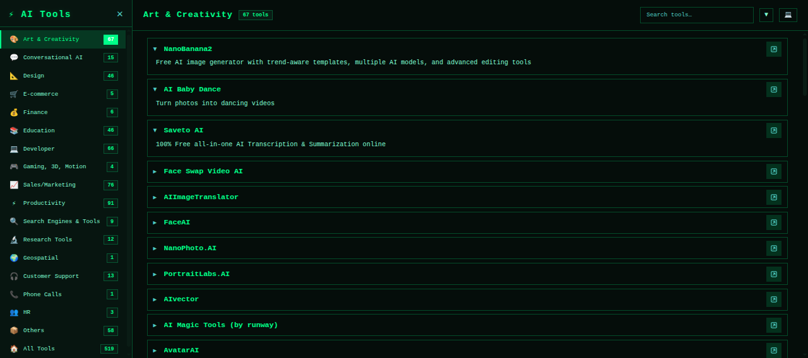

  <h1 align="center">
    ⚡ AI Tools
    
  </h1>

  New AI tools emerge on the internet every day, making it difficult to keep track of what's new and which ones are actually good. By following this page, you can stay up-to-date with the latest AI innovations and essential tools at all times.

  
  

---

  

